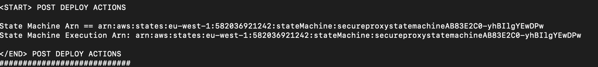
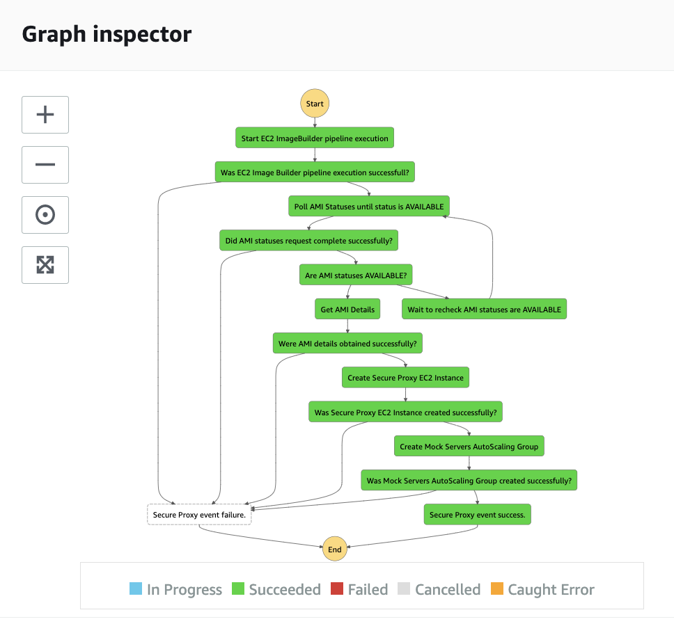
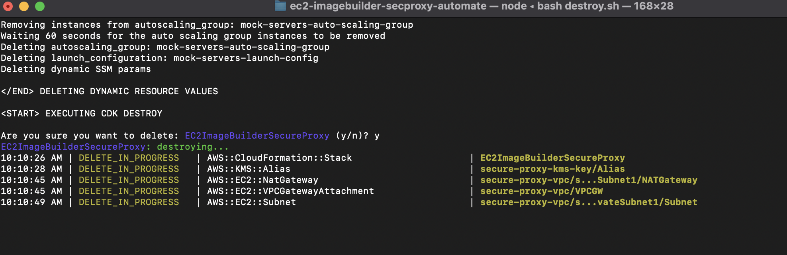

# ec2-imagebuilder-secure-proxy

Securing and modernizing client access to TCP socket applications presents our customers with a unique set of challenges. Customers often need to ensure the authentication of client requests, enforcement of transit encryption as well as providing client access using standard web protocols. To increase complexity even further, our customers often require the implementation of these functionalities to be transparent, restricting any code or configuration changes to the TCP socket application.

This solution describes a pattern for securing and modernizing client access to TCP socket applications by leveraging the [EC2 Image Builder](https://aws.amazon.com/image-builder/) service to create an AMI ([Amazon Machine Images](https://docs.aws.amazon.com/AWSEC2/latest/UserGuide/AMIs.html)) which includes a component that installs a custom build of the open-source [NGINX](https://nginx.org/en) proxy.

The custom AMI generated by the EC2 Image Builder can then be used to launch an EC2 instance which will provide:

* in-transit encryption of client connections using `wss://` ([Secure WebSocket](https://tools.ietf.org/html/rfc6455)) protocol
* authentication of client requests via the validation of a JWT token with an upstream oAuth server
* protocol conversion; `wss://` → `tcp://`, `tcp://` → `wss://`

----

* [Solution overview](#solution-overview)
* [Deploying the solution](#deploying-the-solution)
* [Verifying the solution](#verifying-the-solution)
* [Testing the solution](#testing-the-solution)
* [Clean-up the solution](#clean-up-the-solution)
* [Executing unit tests](#executing-unit-tests)
* [Executing static code analysis tool](#executing-static-code-analysis-tool)
* [Secure Proxy NGINX component](#secure-proxy-nginx-component)
    * [NGINX solution and licenses](#nginx-solution-and-licenses)
    * [NGINX configuration](#nginx-configuration)
    * [Managing the NGINX service](#managing-the-nginx-service)
    * [NGINX logging](#NGINX-logging)
        * [Error logging](#error-logging)
        * [Access logging](#access-logging)
        * [CloudWatch Logging](#cloudwatch-logging)
        * [CloudWatch Metrcis](#cloudwatch-metrics)
    * [NGINX security](#nginx-security)
        * [Securing the NGINX Process](#securing-the-nginx-process)
            * [Root master, unprivileged worker](#root-master,-unprivileged-worker)
            * [NGINX Chroot Jail](#nginx-chroot-jail)
        * [Secure access to the SSL certificates](#secure-access-to-the-ssl-certificates)
        * [JWT Validation](#jwt-validation)
    * [WebSocket client](#websocket-client)
        * [Request headers](#request-headers)
        * [Binary data](#binary-data)
    * [Known issues](#known-issues)
        * [LuaJIT warnings](#luajit-warnings)
        * [Websocket maximum frame size](#websocket-maximum-frame-size)
        * [Websocket text frames not supported](#websocket-text-frames-not-supported)
* [Mock Servers component](#mock-servers-component)
    * [TCP server](#tcp-server)
    * [oAuth server](#oauth-server)
* [Security](#security)
* [License](#license)

# Solution Overview

The solution architecture discussed in this post is presented below:


The core services of the solution architecture are referenced below:

| Core service | Description |
|-----------------|:-------------|
| [EC2 Image Builder](https://aws.amazon.com/image-builder/) | EC2 Image Builder simplifies the building, testing, and deployment of Virtual Machine and container images for use on AWS or on-premises. Image Builder significantly reduces the effort of keeping images up-to-date and secure by providing a simple graphical interface, built-in automation, and AWS-provided security settings. With Image Builder, there are no manual steps for updating an image nor do you have to build your own automation pipeline. EC2 Image Builder is used within this solution to to create AMIs ([Amazon Machine Images](https://docs.aws.amazon.com/AWSEC2/latest/UserGuide/AMIs.html)) which include a component that installs a custom build of the open-source [NGINX](https://nginx.org/en) proxy as well as mock TCP and oAuth servers for testing purposes. |
| [AWS Step Functions](https://aws.amazon.com/step-functions/) | AWS Step Functions is a low-code, visual workflow service that developers use to build distributed applications, automate IT and business processes, and build data and machine learning pipelines using AWS services. Workflows manage failures, retries, parallelization, service integrations, and observability so developers can focus on higher-value business logic. AWS Step Functions are used within this solution to coordinate additional deployment tasks such as executing the EC2 Image Builder pipeline and launching EC2 instances with the generated AMIs. |
| [AWS Lambda](https://aws.amazon.com/lambda/) | AWS Lambda is a serverless, event-driven compute service that lets you run code for virtually any type of application or backend service without provisioning or managing servers. You can trigger Lambda from over 200 AWS services and software as a service (SaaS) applications, and only pay for what you use. AWS Lambda is used within this solution as the compute service that executes the tasks associated with the additional deployment tasks. |
| [Amazon EC2 Auto Scaling](https://docs.aws.amazon.com/autoscaling/ec2/userguide/what-is-amazon-ec2-auto-scaling.html) | Amazon EC2 Auto Scaling helps you ensure that you have the correct number of Amazon EC2 instances available to handle the load for your application. You create collections of EC2 instances, called Auto Scaling groups. You can specify the minimum number of instances in each Auto Scaling group, and Amazon EC2 Auto Scaling ensures that your group never goes below this size. You can specify the maximum number of instances in each Auto Scaling group, and Amazon EC2 Auto Scaling ensures that your group never goes above this size. If you specify the desired capacity, either when you create the group or at any time thereafter, Amazon EC2 Auto Scaling ensures that your group has this many instances. Amazon EC2 Auto Scaling groups are used within this solution to host the mock TCP and oAuth server backend targets. |
| [AWS Network Load Balancer](https://docs.aws.amazon.com/elasticloadbalancing/latest/network/introduction.html) | Elastic Load Balancing automatically distributes your incoming traffic across multiple targets, such as EC2 instances, containers, and IP addresses, in one or more Availability Zones. It monitors the health of its registered targets, and routes traffic only to the healthy targets. Elastic Load Balancing scales your load balancer as your incoming traffic changes over time. It can automatically scale to the vast majority of workloads. A Network Load Balancer functions at the fourth layer of the Open Systems Interconnection (OSI) model. It can handle millions of requests per second. After the load balancer receives a connection request, it selects a target from the target group for the default rule. It attempts to open a TCP connection to the selected target on the port specified in the listener configuration. AWS Network Load Balancer is used within this solution as the load balancer for traffic destined for the mock TCP and oAuth server backend targets. |

AWS Step Functions are executed which are backed by AWS lambda functions that perform the following sequence of tasks.

1. An EC2 Image Builder Pipeline is executed which generates a Secure Proxy AMI. The generated AMI contains a [Secure Proxy NGINX component](#secure-proxy-nginx-component).
2. A secondary EC2 Image Builder Pipeline is executed which generates a Mock Servers AMI which simulates the behavior of a TCP socket application and an oAuth server. The Mock Servers AMI is provided for testing purposes only. In a customer environment, the functionalities of the Mock Servers AMI would be provided by the customer’s own TCP socket application and oAuth server.
3. An EC2 instance is launched in the Public subnet, using the Secure Proxy AMI.
4. An EC2 instance is launched in the Private subnet and added to an [Auto Scaling group](https://docs.aws.amazon.com/autoscaling/ec2/userguide/AutoScalingGroup.html) which is a target group of a [Network Load Balancer](https://docs.aws.amazon.com/elasticloadbalancing/latest/network/introduction.html). The EC2 instance is launched using the Mock Servers AMI.

Following a successful deployment, client applications can interact with the Mock Servers EC2 instance running in the Private subnet.

1. The client application obtains a JWT token via a `https://` request to the public facing Secure Proxy EC2 instance
2. The client application establishes a `wss://` connection to the public facing Secure Proxy EC2 instance. The `wss://` request must contain a valid JWT token which is validated by the Secure Proxy EC2 instance.
3. Client application sends and receives data over the `wss://` connection. The Secure Proxy EC2 instance is providing protocol conversion capabilities such that the `wss://` frames are unpacked into standard TCP packets which are proxied to the TCP socket application. The TCP socket application is unaware that the client application is communicating over a `wss://` connection and the client application is unaware that the backend application is a TCP socket application.

A **note** regarding the SSL certificates that are used by the Secure Proxy NGINX component to encrypt data in-transit. The component uses [openssl](https://www.openssl.org/) to generate a self-signed certificate. The generated security certificate is not signed by a certificate authority. A self-signed certificate is useful for test purposes as they are simple to create, can be generated immediately and are free of charge. However, they do not provide all of the security properties that certificates signed by a CA aim to provide and are not recommended for use in production environments.

For production usage, customers may wish to consider the use of [AWS Certificate Manager for Nitro Enclaves](https://docs.aws.amazon.com/enclaves/latest/user/nitro-enclave-refapp.html). AWS Certificate Manager (ACM) for Nitro Enclaves allows customers to use public and private SSL/TLS certificates with web applications and web servers running on Amazon EC2 instances. ACM for Nitro Enclaves creates secure private keys, distributes the certificate and its private key to an enclave, and manages certificate renewals. The certificate's private key remains isolated in the enclave, preventing the instance, and its users, from accessing it. ACM for Nitro Enclaves works with NGINX servers running on Amazon EC2 instances to install the certificate and seamlessly replace expiring certificates.

# Deploying the solution

The solution code uses the Python flavour of the AWS CDK ([Cloud Development Kit](https://aws.amazon.com/cdk/)). In order to execute the solution code, please ensure that you have fulfilled the [AWS CDK Prerequisites for Python](https://docs.aws.amazon.com/cdk/v2/guide/work-with-cdk-python.html).

Additionally, the project assumes:

* configuration of [AWS CLI Environment Variables](https://docs.aws.amazon.com/cli/latest/userguide/cli-configure-envvars.html).
* the availability of a `bash` (or compatible) shell environment.

The solution code requires that the AWS account is [bootstrapped](https://docs.aws.amazon.com/de_de/cdk/latest/guide/bootstrapping.html) in order to allow the deployment of the CDK stack.

```
# navigate to solution directory
cd ec2-imagebuilder-secure-proxy

# install and activate a Python Virtual Environment
python3 -m venv .venv
source .venv/bin/activate

# install dependant libraries
python3 -m pip install -r requirements.txt

# bootstrap the account to permit CDK deployments
cdk bootstrap
```

Upon successful completion of `cdk bootstrap`, the solution is ready to be deployed.

A utility script is available that will execute the `cdk deploy` command and then it will execute AWS Step Functions that are responsible for completing the remaining deployment steps.

The script can be executed with the command shown below. The script will prompt you to confirm the creation of AWS resources.

```
bash deploy.sh
```

# Verifying the deployment

Following a successful deployment, verify that two new stacks have been created within the AWS account:

* `CDKToolkit`
* `EC2ImageBuilderSecureProxy`

Log into the AWS Console → navigate to the CloudFormation console:


During the execution of the `deploy.sh` script, an AWS State Machine is executed which completes the remaining steps of the deployment.

The final output of the `deploy.sh` deployment script includes the ARN for the State Machine as well as the specific execution ARN.



These two values will help you quickly locate the State Machine as well as the specific execution instance which is performing the remaining deployment tasks.

To check the AWS State Machine, log into the AWS Console → navigate to the Step Functions console. You can search for the State Machine via the `State Machine Arn` value which was displayed by the `deploy.sh` script.

Once you have located the State Machine, you can then search for the specific execution via the the `State Machine Execution Arn` value which was displayed by the `deploy.sh` script.

At this point you will be able to see the Graph Inspector diagram which shows the progress of the State Machine through its tasks.

The State Machine has successfully completed its tasks when all nodes of the graph are green (as shown in the example below). Note that the State Machine can take up to 1 hour to complete its tasks.



# Testing the solution

The solution includes client code that can be used to execute test scenarios.

The client code will execute the following 4 test scenarios:

1. Retrieve an oAuth configuration via the EC2 Secure Proxy instance.
2. Retrieve an oAuth token via the EC2 Secure Proxy instance.
3. Establish a Secure Web Socket connection (containing a valid JWT token) with the EC2 Secure Proxy instance. Send and receive data along this connection. This test scenario validates that:
    1. the client provided a valid JWT token.
    2. the client is sending and receiving data over a Secure Web Socket connection.
    3. the EC2 Secure Proxy instance is performing `wss://` → `tcp://`, `tcp://` → `wss://` protocol conversion.
    4. the TCP socket application is receiving data as standard TCP traffic.
4. Attempt to establish a Secure Web Socket connection (containing an *invalid* JWT token) with the EC2 Secure Proxy instance. The expected outcome is a Http Code 403 Forbidden error.

The solution can be tested via the invocation shown below:

```
bash execute_e2e_tests.sh
```


# Clean-up the solution

Solution clean-up is a 2 step process:

1. Destroy the CDK stack and associated dynamic resources.
2. Delete the *CDKToolkit* stack from CloudFormation.

The CDK stack and associated dynamic resources can be destroyed with the command below:

```
bash destroy.sh
```



When the `destroy.sh` script has completed, the final clean-up task is to delete the CDKToolkit CloudFormation stack.

1. Log into the AWS Console → navigate to the *CloudFormation* console.
2. Navigate to *Stacks*.
3. Select the **CDKToolkit**.
4. Click the *Delete* button.

# Executing unit tests

Unit tests for the solution can be executed via the commands below:

```bash
python3 -m venv .venv
source .venv/bin/activate

# install dependant libraries
python3 -m pip install -r requirements.txt

cdk synth && python3 -m pytest
```

# Executing static code analysis tool

The solution includes [Checkov](https://github.com/bridgecrewio/checkov) which is a static code analysis tool for infrastructure as code (IaC).

The static code analysis tool for the project can be executed via the commands below:

```bash
python3 -m venv .venv
source .venv/bin/activate

# install dependant libraries
python3 -m pip install -r requirements.txt

cdk synth && checkov --config-file checkov.yaml
```

**NOTE:** The Checkov tool has been configured to skip 2 checks.

The Checkov configuration file, [checkov.yaml](checkov.yaml), contains a section named `skip-check`.

```
skip-check:
  - CKV_AWS_18    # Ensure the S3 bucket has access logging enabled
  - CKV_AWS_116   # Ensure that AWS Lambda function is configured for a Dead Letter Queue(DLQ)
```

* Check `CKV_AWS_18` has been skipped due to an infinite dependency issue. The solution defines an S3 bucket that is used for NLB access logs. In order to comply with this rule, the S3 bucket needs to have [server access logging enabled](https://docs.aws.amazon.com/AmazonS3/latest/userguide/enable-server-access-logging.html). To enable server access logging, another S3 bucket is required as the destination for the server access logs. The destination bucket also needs to have server access logging enabled to comply with the rule which creates an infinite dependency issue.
* Check `CKV_AWS_116` fails due to the `CustomS3AutoDeleteObjectsCustomResourceProviderHandler` lambda function which is created by the CDK framework as part of the [aws_s3.Bucket](https://docs.aws.amazon.com/cdk/api/v1/docs/@aws-cdk_aws-s3.Bucket.html) construct. This lambda function does not have a Dead Letter Queue defined. As this is a resource created by the CDK framework, this check is skipped.

# Secure Proxy NGINX component

The Secure Proxy NGINX component provides a solution for:

  1. converting `wss://` (Secure WebSockets) requests to TCP requests and allowing for communication between a WSS client and a TCP socket server
  2. authenticating JWT tokens with an upstream oAuth server

## NGINX solution and licenses

The NGINX solution is built from [source](http://nginx.org/download/) and includes the following 3rd party NGINX modules:

| Module | Description | License |
|-------------|-------------|-------------|
| [nginx](https://www.nginx.com/) | Software load balancer, API gateway, and reverse proxy. | [BSD license](http://nginx.org/LICENSE) |
| [websockify-nginx-module](https://github.com/tg123/websockify-nginx-module) | An embedded port of the [Websockify](https://github.com/kanaka/websockify/) library into an NGINX module | [MIT license](https://github.com/tg123/websockify-nginx-module/blob/master/LICENSE) |
| [lua-nginx-module](https://github.com/openresty/lua-nginx-module) | This module is a core component of [OpenResty](https://openresty.org/). If you are using this module, then you are essentially using OpenResty. | [BSD license](https://github.com/openresty/lua-nginx-module#copyright-and-license) |
| [ngx_devel_kit](https://github.com/vision5/ngx_devel_kit) | The NDK is an NGINX module that is designed to extend the core functionality of the excellent NGINX webserver in a way that can be used as a basis of other NGINX modules. | [BSD license](https://github.com/vision5/ngx_devel_kit/blob/master/LICENSE) |

The following dependant libraries are required by the solution:

| Library | Description | License |
|-------------|-------------|-------------|
| [lua-cjson](https://github.com/mpx/lua-cjson) | Provides JSON support for Lua. | [MIT license](https://github.com/mpx/lua-cjson/blob/master/LICENSE) |
| [lua-resty-http](https://github.com/ledgetech/lua-resty-http) | Lua HTTP client cosocket driver for [OpenResty](http://openresty.org/) / [ngx_lua](https://github.com/openresty/lua-nginx-module). | [BSD license](https://github.com/ledgetech/lua-resty-http/blob/master/LICENSE) |
| [lua-resty-jwt](https://github.com/SkyLothar/lua-resty-jwt) | [JWT](http://self-issued.info/docs/draft-jones-json-web-token-01.html) for ngx_lua and LuaJIT. | [Apache license](https://github.com/SkyLothar/lua-resty-jwt/blob/master/LICENSE) |
| [lua-resty-session](https://github.com/bungle/lua-resty-session) | A secure, and flexible session library for OpenResty. | [BSD license](https://github.com/bungle/lua-resty-session/blob/master/LICENSE) |
| [lua-resty-string](https://github.com/openresty/lua-resty-string) | String utilities and common hash functions for ngx_lua and LuaJIT. | [BSD license](https://github.com/openresty/lua-resty-string#copyright-and-license) |
| [lua-resty-openidc](https://github.com/zmartzone/lua-resty-openidc) | A library for NGINX implementing the OpenID Connect Relying Party (RP) and/or the OAuth 2.0 Resource Server (RS) functionality. | [Apache license](https://github.com/zmartzone/lua-resty-openidc/blob/master/LICENSE.txt) |
| [lua-resty-core](https://github.com/openresty/lua-resty-core) | New FFI-based Lua API for ngx_http_lua_module and/or ngx_stream_lua_module. | [BSD license](https://github.com/openresty/lua-resty-core#copyright-and-license) |

The solution leverages Lua and LuaJIT.

| Library | Description | License |
|-------------|-------------|-------------|
| [Lua](http://www.lua.org/) | Lua is a powerful, efficient, lightweight, embeddable scripting language. | [MIT license](https://www.lua.org/license.html) |
| [LuaJIT](https://luajit.org/) | Just-In-Time Compiler for Lua. | [MIT license](https://github.com/LuaJIT/LuaJIT/blob/v2.1/COPYRIGHT) |

## NGINX configuration

All NGINX compilation, installation and configuration takes place in [stacks/secureproxy/components/secureproxy/install_secure_proxy.template](stacks/secureproxy/components/secureproxy/install_secure_proxy.template).

NGINX requires the following configuration values, which are defined in [cdk.json](cdk.json), see `proxySettings` section:

| Item | Default value | Description |
|-------------|-------------|-------------|
| `jailBaseDir` | `/nginx` | Path to the root of the chroot directory for the NGINX proxy |
| `proxyBaseDir` | `/etc/nginx` | Path to the configuration directory for the NGINX proxy |
| `proxyWorkerProcesses` | `1` | The number of NGINX [worker_processes](https://www.nginx.com/blog/tuning-nginx/). The general rule is to assign 1 worker per CPU core |
| `proxyWorkerConnections` | `20` | The number of NGINX [worker_connections](https://www.nginx.com/blog/tuning-nginx/) |
| `proxyCloudwatchLogGroup` | `SecureProxy` | Stack specific CloudWatch LogGroup for the [nginx proxy logs](#nginx-logging) |
| `keepaliveTimeout` | `120` | Keep alive timeout for NGINX proxy connection |
| `wssProxyBindPort` | `10000` | Port that the NGINX proxy listens for incoming `wss://` requests |
| `oAuthProxyBindPort` | `11080` | Port that the NGINX proxy listens for incoming `https://` requests |
| `kernel_ports_range_start` | `32768` | Start of the port range for kernel reserved ports. Defined in order to prevent port conflicts with the NGINX ports |
| `kernel_ports_range_end` | `61000` | End of the port range for kernel reserved ports. Defined in order to prevent port conflicts with the NGINX ports |
| `proxyPortScaleFactor` | `1000` | The scale factor to apply for port scaling. Port scaling is used to translate the incoming port number to a valid port number for the backend server. For example, if the incoming port is 10000, and the `proxyPortScaleFactor` is 1000, then the scaled port would be 9000 (10000-1000)) |
| `websockifyConnectTimeout` | `30s` | Connection timeout for the Websockify proxy |
| `websockifyReadTimeout` | `60s` | Websockify read timeout for upstream connection |
| `websockifySendTimeout` | `60s` | Websockify send timeout for upstream connection |

NGINX is installed as part of the EC2 Image Builder pipeline.

NGINX is installed on the AMI as a [systemd](https://en.wikipedia.org/wiki/Systemd) service: `nginx`.

The NGINX service is defined on the AMI at `/nginx/etc/systemd/system/nginx.service`.

NGINX is configured on the AMI via configuration file: `/nginx/etc/nginx/nginx.conf`.

## Managing the NGINX service

Some useful commands to manage the NGINX service are provided below:

```bash
# check the service status
sudo systemctl status -l nginx

# stop, start, restart the service
sudo systemctl stop nginx
sudo systemctl start nginx
sudo systemctl restart nginx
```

## NGINX logging

The Secure Proxy solution uses standard, out-of-the-box NGINX logging.

A detailed overview of NGINX logging is available at [Configuring Logging](https://docs.nginx.com/nginx/admin-guide/monitoring/logging/) on the NGINX website.

By default, the Secure Proxy defines three log files:

| Log file | Default path | Description |
|-------------|-------------|-------------|
| `nginx-error.log` | `/nginx/etc/nginx/logs/nginx-error.log` | Error log for the NGINX process |
| `http-error.log` | `/nginx/etc/nginx/logs/http-error.log` | Error log for the `wss://` requests |
| `http-access.log` | `/nginx/etc/nginx/logs/http-access.log` | Access log for the `wss://` requests |

### Error logging

NGINX error logs support the following log levels; `warn`, `error`, `crit`, `alert` and `emerg`.

An example NGINX error log definition is provided below.

```yaml
error_log /etc/nginx/logs/http-error.log debug;
```

### Access logging

NGINX access logs can be customized according to a preferred logging pattern.

An example NGINX access log definition is provided below.

```yaml
log_format main 'remote_addr=\$remote_addr remote_user=\$remote_user timestamp=[\$time_local] request="\$request" '
                'status=\$status bytes_sent=\$body_bytes_sent http_ref="\$http_referer" http_ua="\$http_user_agent" '
                'req_time=\$request_time up_addr=\$upstream_addr up_con_time="\$upstream_connect_time" '
                'up_head_time="\$upstream_header_time" up_res_time="\$upstream_response_time" '
                'up_status=\$upstream_status up_bytes_s=\$upstream_bytes_sent up_bytes_r=\$upstream_bytes_received';

access_log /etc/nginx/logs/http-access.log main;
```

A full listing of the available variables that can be logged within the access log can be found at [Alphabetical index of variables](http://nginx.org/en/docs/varindex.html).

### CloudWatch Logging

All of the above mentioned log files generated by NGINX are pushed to a CloudWatch Log Group with the following details:

| File Path | Log Group | Log Stream |
|-------------|-------------|-------------|
| `/nginx/etc/nginx/logs/nginx-error.log*` | SecureProxy | `{instance_id}/nginx/etc/nginx/logs/nginx-error.log` |
| `/nginx/etc/nginx/logs/http-error.log*` | SecureProxy | `{instance_id}/nginx/etc/nginx/logs/http-error.log` |
| `/nginx/etc/nginx/logs/http-access.log*` | SecureProxy | `{instance_id}/nginx/etc/nginx/logs/http-access.log` |

The CloudWatch Log Group has a retention period of *14 days/2 weeks*.

By default, the [CloudWatch Agent](https://docs.aws.amazon.com/AmazonCloudWatch/latest/monitoring/Install-CloudWatch-Agent.html) is configured using a JSON file at: `/opt/aws/amazon-cloudwatch-agent/etc/amazon-cloudwatch-agent.json`.

A sample configuration is provided below for illustrative purposes.

```json
{
  "logs":{
    "logs_collected":{
      "files":{
        "collect_list":[
          {
            "file_path":"/nginx/etc/nginx/logs/nginx-error.log*",
            "log_group_name":"SecureProxy",
            "log_stream_name":"{instance_id}/nginx/etc/nginx/logs/nginx-error.log"
          },
          {
            "file_path":"/nginx/etc/nginx/logs/http-error.log*",
            "log_group_name":"SecureProxy",
            "log_stream_name":"{instance_id}/nginx/etc/nginx/logs/http-error.log"
          },
          {
            "file_path":"/nginx/etc/nginx/logs/http-access.log*",
            "log_group_name":"SecureProxy",
            "log_stream_name":"{instance_id}/nginx/etc/nginx/logs/http-access.log*"
          }
        ]
      }
    }
  }
}
```
Configuration of the CloudWatch Agent takes place in [stacks/secureproxy/components/secureproxy/install_secure_proxy.template](stacks/secureproxy/components/secureproxy/install_secure_proxy.template).

### CloudWatch Metrics

NGINX metrics are collected via the CloudWatch Agent and a custom Python metric script.

The following metrics are collected for the NGINX process per EC2 instance:

* cpu_usage
* memory_rss
* memory_vms
* read_bytes
* write_bytes
* read_count
* write_count

The following metrics are collected for the NGINX process and are visible within the NGINX namespace:

* ConnectionsActive
* ConnectionsReading
* ConnectionsWriting
* ConnectionsWaiting

## NGINX security

The key elements for security of the Secure Proxy component are:

1. Securing the NGINX process
2. Secure access to the SSL certificates
3. JWT Validation

### Securing the NGINX Process

The NGINX process has been secured using the following approach.

1. Root master, unprivileged workers
2. NGINX Chroot Jail

#### Root master, unprivileged worker

NGINX launches as a master process with the root user. This is to ensure that the NGINX master process can have secure and exclusive access to the SSL certificates.

NGINX then spawns worker processes (the number of processes corresponds to the `worker_processes` value defined in `nginx.conf`) to handle the incoming requests which run as the unprivileged `nginx` user. The unprivileged `nginx` user does not have access to the SSL certificates and does not support interactive login (shell set to `/sbin/nologin`).

#### NGINX Chroot Jail

The NGINX process has been restricted to a limited part of the file system using Linux's in-built [chroot](https://en.wikipedia.org/wiki/Chroot) functionality.

A chroot on Unix operating systems is an operation that changes the apparent root directory for the current running process and its children. A program that is run in such a modified environment cannot name (and therefore normally cannot access) files outside the designated directory tree.

The NGINX process, by default, is chrooted to the directory `/nginx`. The `/nginx` chroot contains only the necessary directories, files and libraries to support NGINX operations. 

### Secure access to the SSL certificates

By default, NGINX is configured to retrieve its SSL certificates from `/nginx/etc/nginx/certs`.

The location of the SSL certificates are defined in `nginx.conf`:

```yaml
ssl_certificate     /etc/nginx/certs/servercert.pem;
ssl_certificate_key /etc/nginx/certs/serverkey.pem;
```

* `ssl_certificate` and `ssl_certificate_key` refer to the SSL certificates that are used to secure the connection between the `wss://` client to proxy connection.

The NGINX installation restricts access to the certificates directory to the root user only. Even in the case of the root user, the access is read-only. All other users are explicitly denied access to the certificates directory.

### JWT Validation

The Secure Proxy supports validation of JWT tokens.

The JWT tokens are validated using a compliant, upstream [OpenID Connect](https://openid.net/connect/) server.

Within the NGINX context, JWT validation is performed using the 3rd party [lua-resty-openidc](https://github.com/zmartzone/lua-resty-openidc) library.

The [lua-resty-openidc](https://github.com/zmartzone/lua-resty-openidc) GitHub page provides various configuration examples.

## WebSocket client

The Secure Proxy backend component supports Secure WebSocket connections. 

### Request headers

The WebSocket client is expected to provide the following request headers:

| Header | Default value | Description |
|-------------|-------------|-------------|
| `Sec-WebSocket-Protocol` | `binary` |  The [Sec-WebSocket-Protocol](https://datatracker.ietf.org/doc/html/rfc6455#section-11.3.4) header field is used in the WebSocket opening handshake. It is sent from the client to the server and back from the server to the client to confirm the subprotocol of the connection.  This enables scripts to both select a subprotocol and be sure that the server agreed to serve that subprotocol. |
| `Sec-WebSocket-Key` | random-key e.g. `n2wfgJF+qto2ahU4+aoNkQ==` |  The [Sec-WebSocket-Key](https://datatracker.ietf.org/doc/html/rfc6455#page-57) header field is used in the WebSocket opening handshake. It is sent from the client to the server to provide part of the information used by the server to prove that it received a valid WebSocket opening handshake.  This helps ensure that the server does not accept connections from non-WebSocket clients (e.g., HTTP clients) that are being abused to send data to unsuspecting WebSocket servers. The Sec-WebSocket-Key header field MUST NOT appear more than once in an HTTP request. |
| `Sec-WebSocket-Version` | `13` |  The [Sec-WebSocket-Version](https://datatracker.ietf.org/doc/html/rfc6455#page-60) header field is used in the WebSocket opening handshake. It is sent from the client to the server to indicate the protocol version of the connection. This enables servers to correctly interpret the opening handshake and subsequent data being sent from the data, and close the connection if the server cannot interpret that data in a safe manner.  The Sec-WebSocket-Version header field is also sent from the server to the client on WebSocket handshake error, when the version received from the client does not match a version understood by the server.  In such a case, the header field includes the protocol version(s) supported by the server. Note that there is no expectation that higher version numbers are necessarily backward compatible with lower version numbers. |
| `Upgrade` | `websocket` |  The HTTP 1.1 (only) [Upgrade header](https://developer.mozilla.org/en-US/docs/Web/HTTP/Headers/Upgrade) can be used to upgrade an already established client/server connection to a different protocol (over the same transport protocol). For example, it can be used by a client to upgrade a connection from HTTP 1.1 to HTTP 2.0, or an HTTP or HTTPS connection into a WebSocket. |
| `Authorization` | `Bearer JWT_TOKEN` |  The HTTP Authorization request header contains the credentials to authenticate a user agent with a server. The `Bearer` OAuth Access Token Type must contain the OIDC JWT token value. |

#### Binary data

The WebSocket client must ensure that it is sending its payload using the `binary` method.

Text payloads can be converted into byte arrays in order to send the data in the WebSocket `binary` format. It is also important that each payload ends with a [LF New Line character](https://en.wikipedia.org/wiki/Newline), specifically the string `\n`.

Two illustrative examples, in Python and NodeJs respectively, demonstrate how to send a `binary` payload as part of a WebSocket client request.

*Python*

```python
# pip install websocket
import websocket

header={
    'Authorization': f"Bearer {jwt_val}", # jwt_val is a JWT token obtained from an OIDC server
    'Sec-WebSocket-Key': 'n2wfgJF+qto2ahU4+aoNkQ==',
    'Sec-WebSocket-Protocol': 'binary',
    'Sec-WebSocket-Version': '13',
    'Upgrade': 'websocket'
}

ws = websocket.create_connection(
    self.url,
    sslopt={"cert_reqs": ssl.CERT_NONE,
            "check_hostname": False
    },
    header=header
)

NEW_LINE_CHAR = "\n" # NOTE: is is important to include a new line char as the final char of your payload
payload = "Hello World" + NEW_LINE_CHAR
bytearray(payload.encode()) # convert the string to a bytearray payload
ws.send_binary(payload_with_newline)
bin_answer = ws.recv_frame()
print("----BINARY RESPONSE CODE---")
print(websocket.ABNF.OPCODE_MAP[bin_answer.opcode])
print("----BINARY RESPONSE DATA---")
response = bytearray(bin_answer.data).decode()
print(f"Received response: {response}")
ws.close()
```

*NodeJs*

```javascript
// npm install websocket
// npm install string-to-arraybuffer
import WebSocket from 'ws';
const str2Ab =require('string-to-arraybuffer')

const NEW_LINE_CHAR = "\n" // NOTE: is is important to include a new line char as the final char of your payload
const payload = "Hello World" + NEW_LINE_CHAR
const payloadAsArrayBuffer = str2Ab(payload)

const headers = {
    'Authorization': f"Bearer " + jwt_val, // jwt_val is a JWT token obtained from an OIDC server
    'Sec-WebSocket-Key': 'n2wfgJF+qto2ahU4+aoNkQ==',
    'Sec-WebSocket-Protocol': 'binary',
    'Sec-WebSocket-Version': '13',
    'Upgrade': 'websocket'
}

const ws = new WebSocket('ws://www.host.com/path', 'binary', headers);
ws.on('open', function open() {
  ws.send(payloadAsArrayBuffer);
});
```

## Known issues

Below is a list of known issues with the Secure Proxy solution.

### LuaJIT warnings

Within the NGINX logs, you may see output similar to that shown below:

```bash
Aug 13 10:10:53 ip-172-31-16-141.ec2.internal chroot[3476]: nginx: [alert] detected a LuaJIT version which is not OpenResty's; many optimizations will be disabled and performance will be compromised (see https://github.com/openresty/luajit2 for OpenResty's LuaJIT or, even better, consider using the OpenResty releases from https://openresty.org/en/download.html)
Aug 13 10:10:54 ip-172-31-16-141.ec2.internal chroot[3476]: nginx: [alert] [lua] base.lua:41: use of lua-resty-core with LuaJIT 2.0 is not recommended; use LuaJIT 2.1+ instead
Aug 13 10:10:54 ip-172-31-16-141.ec2.internal chroot[3476]: nginx: [alert] [lua] lrucache.lua:16: use of lua-resty-lrucache with LuaJIT 2.0 is not recommended; use LuaJIT 2.1+ instead
```

As of the time of writing (08/2021), the LuaJIT 2.1+ library that the alert log message references is in a beta stage, [LuaJIT releases](https://github.com/LuaJIT/LuaJIT/releases). Until LuaJIT 2.1 becomes stable, it is recommended to remain on the current stable version LuaJIT v2.0.5.

Please note that upgrading the LuaJIT version to 2.1 may require a cascade of updates in dependant components so any upgrade should be thoroughly tested.

### Websocket maximum frame size

The [websockify-nginx-module](https://github.com/tg123/websockify-nginx-module), which provides the `wss://` to `tcp://` protocol conversion, enforces a fixed limit for websocket maximum frame size.

The websocket maximum frame size is defined as `65535`.

This websocket maximum frame size is defined in:

* [websocket.h](https://github.com/tg123/websockify-nginx-module/blob/master/websocket.h), see `#define MAX_WEBSOCKET_FRAME_SIZE 65535`
* [ngx_http_websockify_module.c](https://github.com/tg123/websockify-nginx-module/blob/master/ngx_http_websockify_module.c), see code block below:

```c
header_length = websocket_server_decode_next_frame(&frame, buf, size);

    if (header_length == NGX_ERROR) {
        ngx_log_error(NGX_LOG_ERR, c->log, 0,
                      "%s: decoding websocket frame > 65535 is not supported!",
                      WEBSOCKIFY_FUNC);
        return NGX_ERROR;
    }
```

If the websocket maximum frame size limit is too restrictive, the [websockify-nginx-module](https://github.com/tg123/websockify-nginx-module) code should be modified appropriately and recompiled into NGINX.

See [stacks/secureproxy/components/secureproxy/install_secure_proxy.template](stacks/secureproxy/components/secureproxy/install_secure_proxy.template) for example of NGINX module compilation:

```yaml
CONFIG="\
    --prefix=/etc/nginx \
    --sbin-path=/usr/sbin/nginx \
    --modules-path=/usr/lib/nginx/modules \
    --conf-path=/etc/nginx/nginx.conf \
    --error-log-path=/var/log/nginx/error.log \
    --http-log-path=/var/log/nginx/access.log \
    --pid-path=/var/run/nginx.pid \
    --lock-path=/var/run/nginx.lock \
    --http-client-body-temp-path=/var/cache/nginx/client_temp \
    --http-proxy-temp-path=/var/cache/nginx/proxy_temp \
    --http-fastcgi-temp-path=/var/cache/nginx/fastcgi_temp \
    --http-uwsgi-temp-path=/var/cache/nginx/uwsgi_temp \
    --http-scgi-temp-path=/var/cache/nginx/scgi_temp \
    --user=nginx \
    --group=nginx \
    --with-http_ssl_module \
    --with-http_realip_module \
    --with-http_addition_module \
    --with-http_sub_module \
    --with-http_dav_module \
    --with-http_flv_module \
    --with-http_mp4_module \
    --with-http_gunzip_module \
    --with-http_gzip_static_module \
    --with-http_random_index_module \
    --with-http_secure_link_module \
    --with-http_stub_status_module \
    --with-http_auth_request_module \
    --with-http_xslt_module=dynamic \
    --with-http_image_filter_module=dynamic \
    --with-http_geoip_module=dynamic \
    --with-threads \
    --with-stream \
    --with-stream_ssl_module \
    --with-stream_ssl_preread_module \
    --with-stream_realip_module \
    --with-stream_geoip_module=dynamic \
    --with-http_slice_module \
    --with-mail \
    --with-mail_ssl_module \
    --with-compat \
    --with-file-aio \
    --with-http_v2_module \
    --add-module=${BUILD_DIR}/websockify-nginx-module-${WEBSOCKIFY_NGINX_MODULE_VERSION} \
    --add-module=${BUILD_DIR}/lua-nginx-module-${LUA_NGINX_MODULE_VERSION} \
    --add-module=${BUILD_DIR}/ngx_devel_kit-${NGINX_DEV_VERSION}"
```

### Websocket text frames not supported

The [websockify-nginx-module](https://github.com/tg123/websockify-nginx-module), which provides the `wss://` to `tcp://` protocol conversion, does not support the sending of text frames.

Not supporting text frames is by design, as [described by the author of the library](https://github.com/novnc/websockify/issues/365):

> The WebSocket protocol is a bit of an oddball, so it has two modes of sending stuff. Either as text, or as raw data. But we need to proxy to normal TCP services which only sees data. So we naturally only use the raw data mode of WebSockets. The older code did accept incoming text messages and mixed those in with any data messages. But it would only send data messages back, so we ended up in some kind of jumble. So now we keep things sane and only accept data messages. From JavaScript that means you need to avoid sending text strings and use data types such as Uint8Array. Basically use the same data type as you are getting back in your message events.

The workaround is to send data in binary format, as described in [Binary data](#binary-data).

## Mock Servers component

The Mock Servers component is provided for testing purposes only and includes docker images which simulate the behavior of a TCP socket application and an oAuth server.

### TCP Server

The TCP socket application functionality is provided by docker image; https://hub.docker.com/r/venilnoronha/tcp-echo-server/.

The docker image is used in accordance with its BSD-style license; https://github.com/venilnoronha/tcp-echo-server/blob/master/LICENSE.

The port number that the TCP socket application listens on is configured in the [cdk.json](cdk.json) file via the `tcpServerPort` parameter.

### oAuth Server

oAuth server functionality is provided by docker image; https://github.com/navikt/mock-oauth2-server.

The docker image is used in accordance with its MIT license; https://github.com/navikt/mock-oauth2-server/blob/master/LICENSE.

The port number that the mock oAuth server listens on is configured in the [cdk.json](cdk.json) file via the `oAuthServerPort` parameter.

# Security

See [CONTRIBUTING](CONTRIBUTING.md#security-issue-notifications) for more information.

# License

This library is licensed under the MIT-0 License. See the LICENSE file.